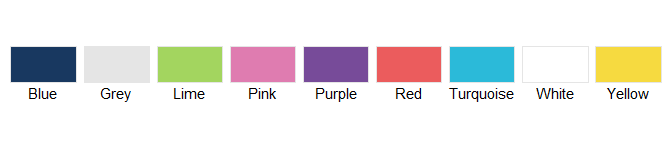
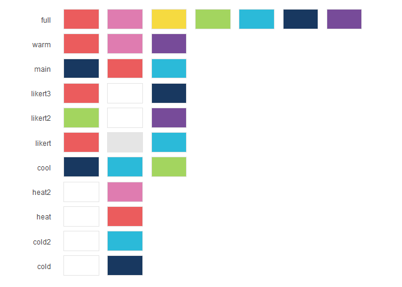
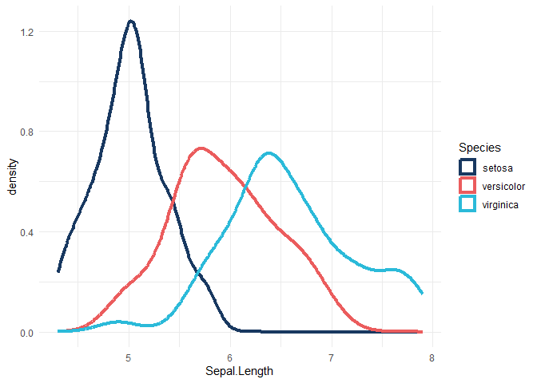

<!-- README.md is generated from README.Rmd. Please edit that file -->

# dfethemes

This package seeks to create an easy theme to add to any ggplot to keep
it in line with DfE brand guidelines.

## Colours

There are two functions that work to add in colour scales:
`scale_fill_dfe()` and `scale_colour_dfe()`. These replace the usual
`scale_colour_*()` and `scale_fill_*()` functions to change colours on
ggplot.

These are the base colours



There are also palettes, passed to the ‘palettes’ argument. These are
for selecting a suitable subset of the colours above, depending on if
you need a discrete, continuous or diverging palette.

- main - Blue red turquoise (discrete, 3 colours)
- warm - Red to purple (continuous)
- cool - Blue to lime (continuous)
- full - all colours in the brand (discrete, 7 colours)
- likert - red to blue, grey midpoint (diverging)
- likert2 - green to purple, white midpoint (diverging)
- likert3 - red to blue, white midpoint (diverging)
- heat - white to red (continuous)
- heat2 - white to pink (continuous)
- cold - white to blue (continuous)
- cold2 - white to turqouise (continuous)



Exaples of usage would be:

``` r
ggplot2::ggplot(data = iris)+
  ggplot2::aes(x=Sepal.Length, colour = Species)+
  ggplot2::geom_density(linewidth = 1.5)+
  scale_colour_dfe(palette = "main")+
  ggplot2::theme_minimal()
```


